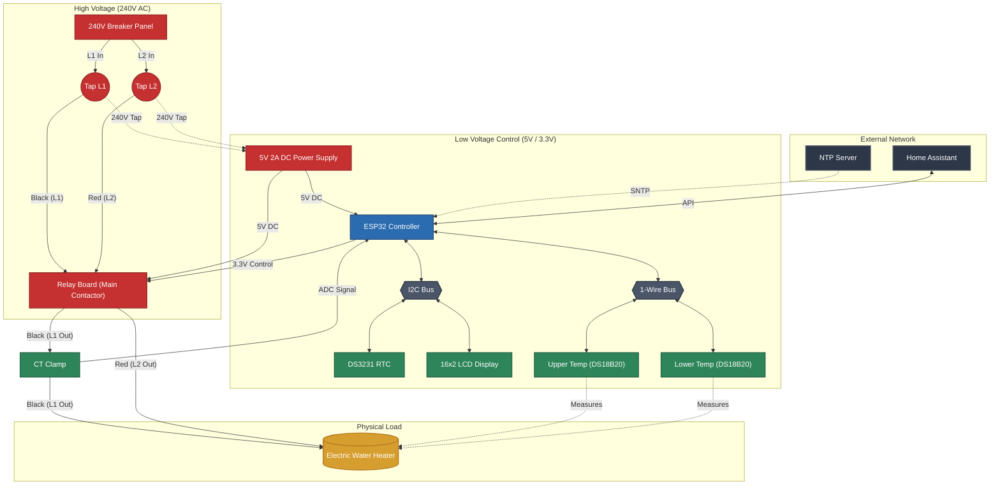
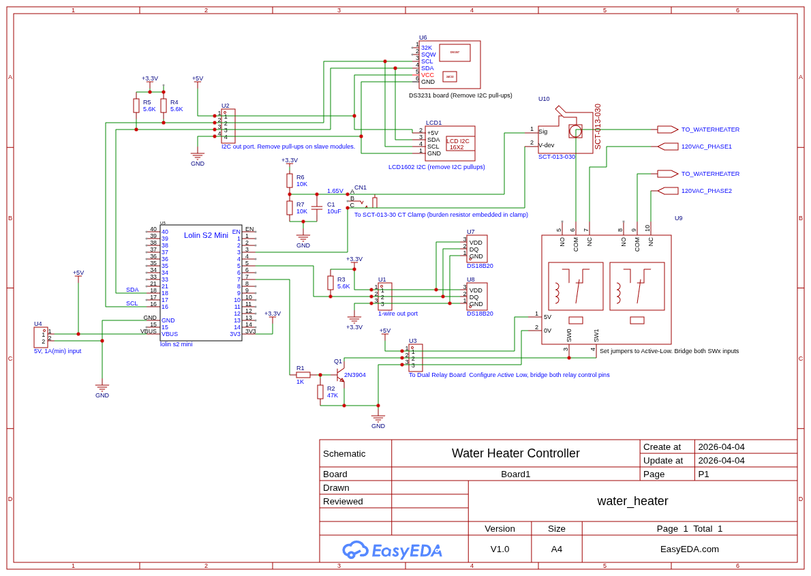
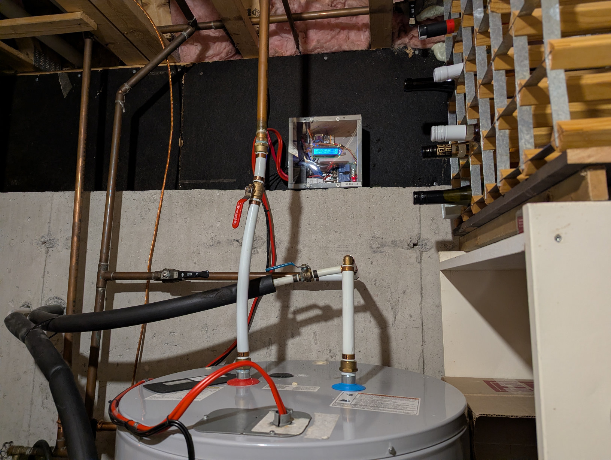
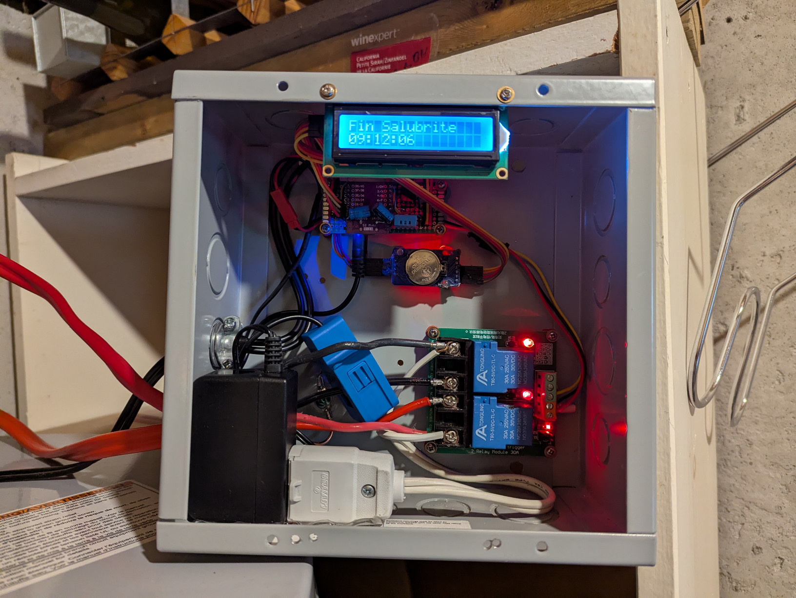

# ESPHome Smart Water Heater Controller

This project transforms a standard electric water heater into a smart, energy‑efficient (hopefully), and safe appliance using ESPHome on an ESP32‑S2. It is designed to run autonomously when Home Assistant or Wi‑Fi is unavailable, while prioritizing public health (Legionella prevention) and hardware safety. The controller sits in between mains and the power in going to the water heater.

Note: No hardware design documentation is provided. This repo assumes you will design and build your own hardware (wiring, enclosure, protection, clearances) to your local electrical code and safety standards.

## Features
- Salubrity (Legionella Prevention): Enforces a sanitization cycle at least once every 24 hours. When both upper and lower probes reach 60°C, holds for 30 minutes.
- Vacation Mode: Persistent switch that immediately forces the heater OFF, overriding other modes except critical failsafes. Salubrity check-up is ignored.
- Manual Override Mode: Full manual control via Home Assistant, with automatic fallback to autonomous logic if API connectivity is lost, and a safety auto‑reset if HA stays disconnected too long. Salubrity check-up is still running.
- Scheduled ON Mode: Two configurable time windows that force the heater ON for peak availability (including schedules that cross midnight).
- Off‑Peak Economy Mode: Default mode that heats only when needed; includes overshoot logic, a minimum relay toggle delay, and a boot safety delay before the automatic control logic starts making heating decisions.
- Stand‑Alone Resilience: Hardware RTC (DS3231) keeps accurate time across power/network loss; schedules and salubrity run offline using the RTC.
- Failsafe Logic: If system time is invalid (dead RTC + no network) or probes fail/stall, the controller forces the relay into its configured safe state (in this build, wired so the heater remains powered even if the controller crashes/malfunctions).
- Monitoring & Diagnostics:
  - 16×2 LCD pages for status (temps, amps, relay reason, connectivity, last salubrity time).
  - Connectivity status indicators and icons.
  - Current monitoring with a latching fault sensor: turns ON after 5s continuous out‑of‑range and persists across reboots until manually reset.
  - RTC internal temperature reporting (read directly from the DS3231 over I2C).
  - Relay cycle counter (diagnostic) to track relay wear.
- Recovery & Maintenance:
  - Built-in fallback AP + captive portal if Wi‑Fi cannot connect.
  - Lightweight onboard web server for quick local inspection.
  - Periodic “maintenance” resync from the hardware RTC to reduce drift.
  - Factory reset: long‑press GPIO0 to trigger reset, or 5 successive short reboots to wipe persisted config

### Mode Precedence
- Salubrity preempts all other modes (including Manual Override and Schedules) to ensure public‑health compliance.
- Only in Vacation Mode is salubrity deactivated; while Vacation Mode is ON, the heater is forced OFF and salubrity cycles are not executed.

## Hardware Used 
- AC‑DC 220V → 5V DC converter, galvanically isolated. Using a UL-certified AC-DC "wall" adapter with proper specs is an acceptable solution.
- ESP32‑S2 Lolin Mini
- Two Dallas 1‑Wire temperature probes (e.g., DS18B20) for upper and lower tank temps
- Single CT clamp, 30 A
- Dual 30 A relay board, both relays wired to toggle simultaneously
- RTC DS3231 module, modified to supply 3.3 V to the RTC IC (two diodes in series on supply)
- LCD HD44780 16×2 with I2C backpack (PCF8574)
- "Boot" button on Lolin S2 Mini repurposed as a factory reset button (GPIO0)

Recommended extras (design‑dependent, not provided): appropriate fusing, contactor/relay isolation, pull‑ups for 1‑Wire/I2C as needed, ferrules, DIN‑rail enclosure, strain relief, and mains‑rated wiring/clearances.

### System Architecture

High-level schematic of how system components are connected.



### Electrical Schematic

Main wiring schematic:



Editable CAD source (DXF, zipped):

- [schematic/DXF_Water Heater Controller_2026-4-4.zip](schematic/DXF_Water%20Heater%20Controller_2026-4-4.zip)

#### Note
Not represented in the schematic is the AC/DC converter sourcing from dual phases 240V and outputting 5VDC to entire system.

Also not represented is metal enclosure wired to protective earth/ground.

Please note that regulations in most region would prevent sourcing 5V power from outside the system. It would also be against regulations to connect AC/DC converter to a single phase and protective earth/ground. 


### Photos

| Installed & Mounted | Interior Close-up |
| --- | --- |
|  |  |

## Safety Notes
- Mains electricity is dangerous. Build only if you are qualified and comply with local electrical codes.
- Provide proper isolation, creepage/clearance, fusing, and over‑current protection.
- Verify relay/contact ratings and thermal behavior under load.
- The author does not provide hardware wiring schematics; you are responsible for your design.
- Check your local regulations on water heater salubrity guidelines 

## Configure & Flash
1. Install ESPHome CLI.
2. Start from the example device configuration in `example/device.yaml` to integrate this package into your own ESPHome node.
3. Adjust substitutions and secrets for your board, wiring, and network.
4. Build and upload.

### Language Selection

In your device file, select the language by adding exactly one translation file in `packages.remote_package_files.files`.
Current supported languages are located in the `translations` folder of this package.

Example:

```yaml
packages:
    remote_package_files:
        url: https://github.com/bennydiamond/esphome_water_heater_controller
        files:
            - alimentation-chauffe-eau.yaml
            - translations/fr.yaml  # or translations/en.yaml
```


### Hardware Substitutions

The shared package in `alimentation-chauffe-eau.yaml` expects board-specific values to be defined in the `substitutions:` block of your device file. The repository includes `example/device.yaml` as a working example of how to implement the package and override the hardware-dependent values.

These substitutions are design-specific. You must review them and set them for your own board and wiring rather than copying the example blindly.

| Substitution key | Required for | Description |
| --- | --- | --- |
| `contactor_gpio_pin` | Relay/contactor control | GPIO that drives the heater contactor or relay board. Set this to the output actually connected to your switching stage. |
| `contactor_gpio_pin_mode` | Relay/contactor control | ESPHome pin mode used for the relay output, for example `OUTPUT` or `OUTPUT_OPEN_DRAIN`, depending on how your driver circuit is designed. |
| `contactor_gpio_inverted` | Relay/contactor control | ESPHome pin inversion logic used for the relay output, for example `true` or `false`, depending on how your driver circuit is designed. |
| `one_wire_bus_gpio` | Dallas probes | GPIO connected to the 1-Wire bus used by the tank temperature probes. |
| `dallas_probe_upper_address` | Upper tank probe | 64-bit ROM address of the upper Dallas probe on the 1-Wire bus. This is not a GPIO, but it is part of the hardware mapping required for the package to read the correct sensor. |
| `dallas_probe_lower_address` | Lower tank probe | 64-bit ROM address of the lower Dallas probe on the 1-Wire bus. |
| `i2c_bus_sda_gpio` | I2C bus | GPIO used for the SDA line shared by the RTC and LCD backpack. |
| `i2c_bus_scl_gpio` | I2C bus | GPIO used for the SCL line shared by the RTC and LCD backpack. |
| `adc_clamp_gpio` | CT clamp input | ADC-capable GPIO connected to the current clamp measurement circuit. Pick a pin that is valid for ADC on your ESP32 variant. |
| `factory_reset_gpio` | Reset button | GPIO used by the factory reset push button. On the example board this is the boot button, but your design may use a different pin. |

## Key Configuration Points
- Substitutions let you tune temperatures, timing, and current ranges without editing logic.
- Hardware-related substitutions, especially GPIO assignments, must be defined in your device YAML to match your own electrical design.
- RTC synchronization: SNTP updates the DS3231 when available; otherwise the RTC drives schedules.
- Anti‑toggle timing prevents rapid relay cycling.
- Manual override respects HA connectivity; if HA is down, autonomous logic resumes.
- Manual state changes can be queued when heating is temporarily disallowed (e.g., during boot delay, salubrity cycle, or failsafe) and applied when safe.
- Salubrity has highest priority and runs regardless of Manual Override; only Vacation Mode suppresses salubrity.

## Todo
- Self-monitoring of enclosure temperature based on RTC's internal temperature sensor (and optionally ESP32 internal temperature sensor)